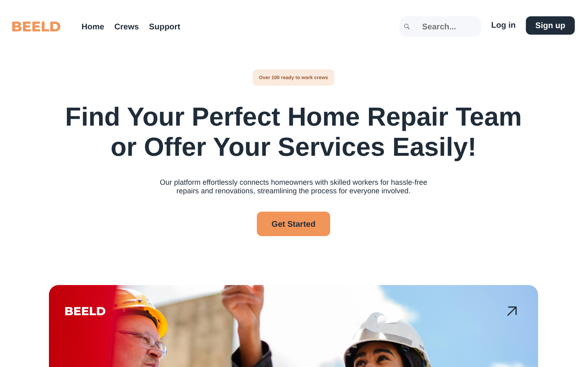
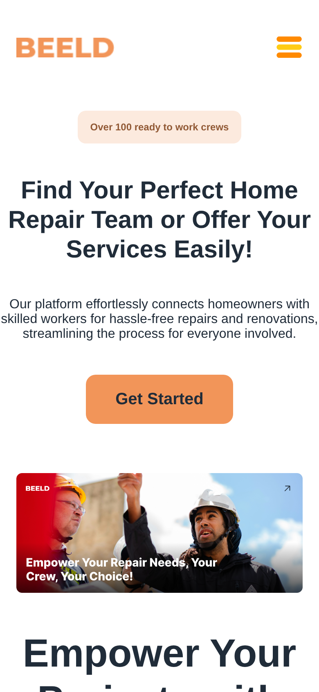
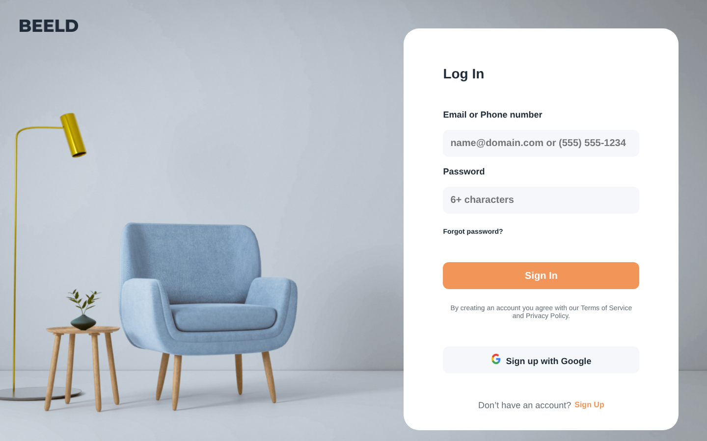

# BEELD – Plattform für Handwerker-Teams

Landingpage und Auth-Screens für eine Plattform, die Hausbesitzer mit Handwerker-Teams
(„Crews“) für Reparaturen und Renovierungen verbindet. Das Projekt habe ich 2024 komplett
von Hand gebaut, um Layout, SCSS und Routing in React sauber zu üben.

**Stack:** React 18 · React Router 6 · SCSS (komponentenweise) · Create React App

| Desktop | Mobile |
|---|---|
|  |  |
|  | |

## Umfang

- **Startseite:** Hero, Feature-Grid, Projekt-Galerie, Bewertungen, Footer
- **Login / Registrierung** mit eigenem Layout (ohne Navbar)
- **Crews-Seite** mit Länder-Dropdown (Klick außerhalb schließt das Menü) und Suche
- **Responsiv** bis 390 px, Burger-Menü auf Mobile
- Entwicklung in Feature-Branches mit Pull Requests (`created/navbar`, `auth/done`, `crewpage` …)

## Status

Frontend-Prototyp, nicht weiterentwickelt. Kein Backend: Login und Suche sind nur UI,
die Crews-Seite ist unvollständig.

<!-- Design: [AUTOR / FIGMA-LINK EINTRAGEN, falls das Layout aus einer Vorlage stammt] -->

## Lokal starten

```bash
npm install
npm start      # http://localhost:3000
```
